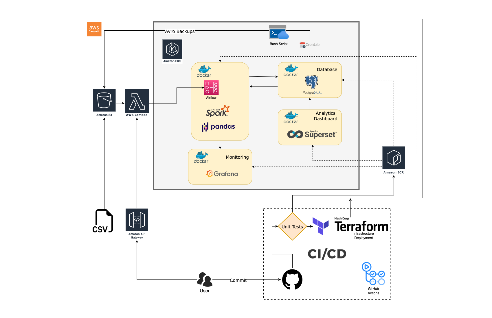

# Employee database migration 

This project is big data migration to a new database system. 
The code will read CSV files and send then to a postgres database.
We will also use REST APIs to insert new batches of data.
A cron job will automatically backout tge database in AVRO files.
Backout files will be stored in a Google Drive for security reasons.
Finally, there will be an API to restore AVRO backout files back to 
the postgres database.

## Techologies Used 

- Python 
- Postgres 
- Rest API 
- Cron job 
- AWS
- Airflow
- Docker
- Spark
- Grafana
- Superset
- Terraform
- Github Actions


## Setup 

### PostgreSQL

1. Install PostgreSQL in your local machine.

```bash
brew install postgresql
```

2. Starting and Stopping the Postgres Service
```bash
# to start a postgres connection
brew services start postgresql

# to stop a postgres connection
brew services stop postgresql
```

3. Configure the Postgres Database Server
```bash
# Login to postgres admin
psql postgres

# Add new user and add database creation access permissions
CREATE ROLE newUser WITH LOGIN PASSWORD "pass";
ALTER ROLE newUser CREATEDB;

# Quit postgres session and login again with new user
\q 
psql postgres -U newuser
```

4. Create Local Database
```bash
# Create database
CREATE DATABASE mydatabase;
\l
```

5. Create database.ini file with credentials in project root folder. Add the following parameters:
```
[postgresql]
host=localhost
database=mydatabase
user=newUser
password=pass
```

